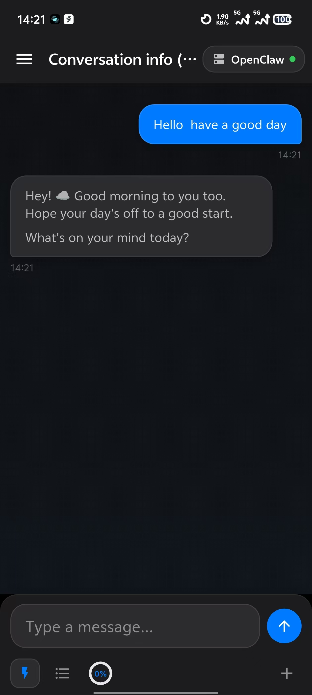
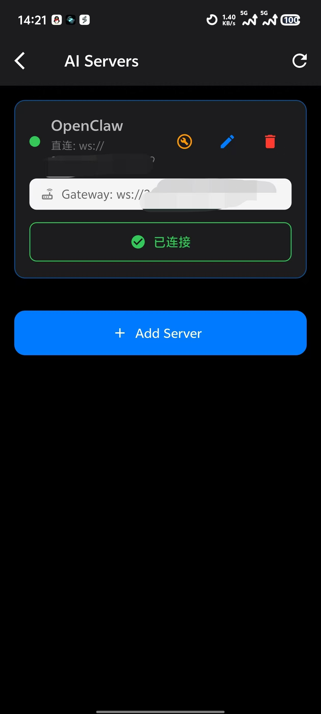
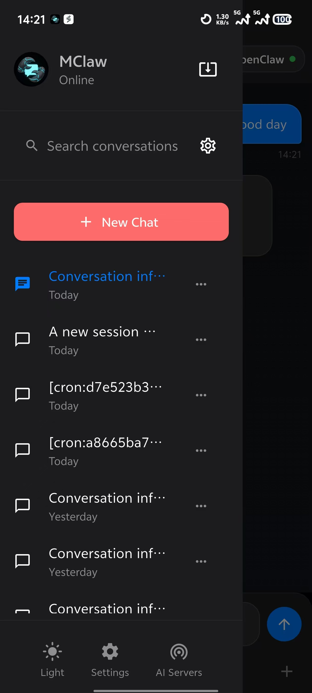

# MClaw

> Language: **English** | [简体中文](./README.zh-CN.md)

MClaw is an Android-first Flutter client for OpenClaw Gateway.

## Features

- Connect with `sshTunnel` or `direct` (`ws://` / `wss://`)
- One-click direct deployment (now starts immediately, no domain input)
- Streaming chat with auto-follow
- Stable markdown rendering (table horizontal scroll, text constrained in bubble)
- Image attachment (camera/gallery)
- Background runtime + completion notifications (Android)
- Update check with red-dot indicators
- Chinese/English support (default follows system language)

## Quick Start

```bash
flutter pub get
flutter run
```

Build release APK:

```bash
flutter build apk --release
```

Output:

- `build/app/outputs/flutter-apk/app-release.apk`

## OpenClaw Notes

- Gateway usually needs `controlUi.allowInsecureAuth: true` for write scope in no-device-identity setups.
- Session mutation APIs (`sessions.patch` / `sessions.delete`) require `operator.admin`.
- Stream completion may come from both `agent done` and `agent lifecycle end`.

## Add Images to README

Use standard Markdown image syntax:

```md

```

Recommended structure:

- Put screenshots under `assets/screenshots/`
- Use relative paths (`./assets/screenshots/xxx.png`)
- Keep file names lowercase and dash-separated (`server-dialog-en.png`)

Click-to-open image:

```md
[](./assets/screenshots/home.png)
```

## Screenshots







## License

MIT. See [LICENSE](./LICENSE).
